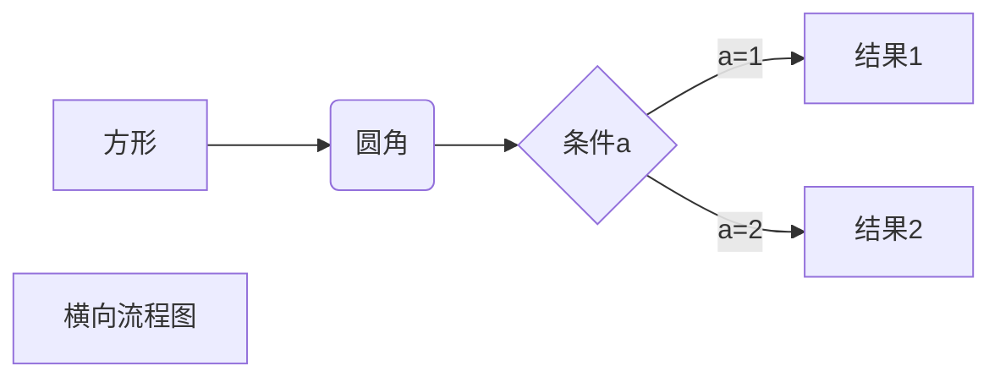
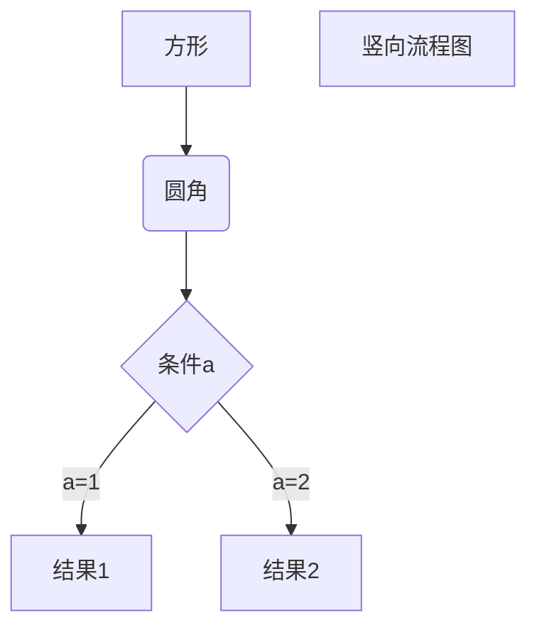
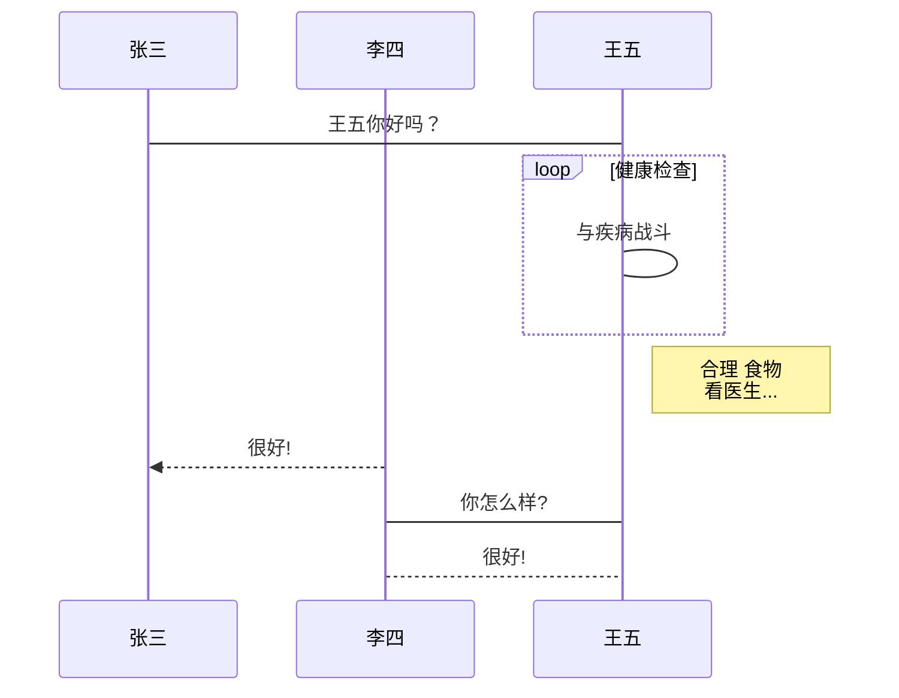
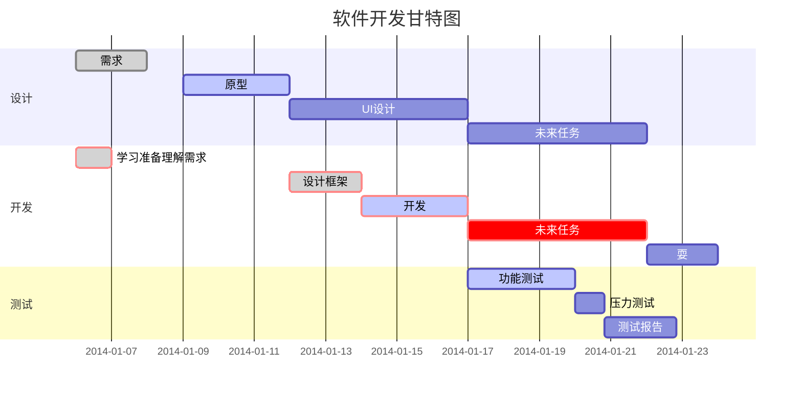

# 〇、MARKDOWN简介

Markdown流行起来就是因为它简单。不知道有没有直接用HTML写文章或是论文的，反正我是没见过，但是Markdown可以。更容易理解的解释是，当你想快速写篇丰富格式且又美观的文章，却又不想打开Word时，你可以用Markdown，手不离键盘，快速高效。而转换为HTML只是它的实现形式而已。


### 优点：

Markdown的简单直观(这个简单直观其实是对用户而言的)就是它的优点。

①、它语法简单，能快速编写，几分钟就能了解它的全部语法。相对另一种标记语言HTML各种复杂的标签，Markdown对使用者更加友好。相对于平时用的Word的各种密密麻麻的按钮（你肯定见过好多Word培训的书），它编写起来更快，更简单。

②、它能直接阅读，而没有HTML的各种标签的干扰。就算不转换成HTML看起来也毫无压力啊！

语法简单，能快速编写，直接阅读，这就是我指的简单直观。


### 缺点：

也是它的简单直观。


# 一、标题

在想要设置为标题的文字前面加#来表示
 一个#是一级标题，二个#是二级标题，以此类推。支持六级标题。

注：标准语法一般在#后跟个空格再写文字，貌似简书不加空格也行。

示例：

```
# 这是一级标题
## 这是二级标题
### 这是三级标题
#### 这是四级标题
##### 这是五级标题
###### 这是六级标题
```

效果如下：

# 这是一级标题

## 这是二级标题

### 这是三级标题

#### 这是四级标题

##### 这是五级标题

###### 这是六级标题

------

# 二、字体

- ##### 加粗

要加粗的文字左右分别用两个*号包起来

- ##### 斜体

要倾斜的文字左右分别用一个*号包起来

- ##### 斜体加粗

要倾斜和加粗的文字左右分别用三个*号包起来

- ##### 删除线

要加删除线的文字左右分别用两个~~号包起来

示例：

```
**这是加粗的文字**
*这是倾斜的文字*`
***这是斜体加粗的文字***
~~这是加删除线的文字~~
```

效果如下：

**这是加粗的文字**
 *这是倾斜的文字*
 **这是斜体加粗的文字**
 ~~这是加删除线的文字~~

------

# 三、引用

在引用的文字前加>即可。引用也可以嵌套，如加两个>>三个>>>
 n个...
 貌似可以一直加下去，但没神马卵用

示例：

```
>这是引用的内容
>>这是引用的内容
>>>>>>>>>>这是引用的内容
```

效果如下：

> 这是引用的内容
>
> > 这是引用的内容
> >
> > > > > > > > > > 这是引用的内容

# 四、分割线

三个或者三个以上的 - 或者 * 都可以。

示例：

```
---
----
***
*****
```

效果如下：
 可以看到，显示效果是一样的。

------

------

------

------

# 五、图片

语法：

```


图片alt就是显示在图片下面的文字，相当于对图片内容的解释。
图片title是图片的标题，当鼠标移到图片上时显示的内容。title可加可不加
```

示例：

```

```

效果如下：


blockchain

**上传本地图片直接点击导航栏的图片标志，选择图片即可**

# 六、超链接

语法：

```
[超链接名](超链接地址 "超链接title")
title可加可不加
```

示例：

```
[简书](http://jianshu.com)
[百度](http://baidu.com)
```

效果如下：

[简书](https://www.jianshu.com/u/1f5ac0cf6a8b)
 [百度](http://baidu.com)

[我的链接](http://126.com)

注：Markdown本身语法不支持链接在新页面中打开，貌似简书做了处理，是可以的。别的平台可能就不行了，如果想要在新页面中打开的话可以用html语言的a标签代替。

```
<a href="超链接地址" target="_blank">超链接名</a>

示例
<a href="https://www.jianshu.com/u/1f5ac0cf6a8b" target="_blank">简书</a>
```

------

# 七、列表

- ##### 无序列表

语法：
 无序列表用 - + * 任何一种都可以

```
- 列表内容
+ 列表内容
* 列表内容

注意：- + * 跟内容之间都要有一个空格
```

效果如下：

- 列表内容

- 列表内容

- 列表内容

- ##### 有序列表

语法：
 数字加点

```
1.列表内容
2.列表内容
3.列表内容

注意：序号跟内容之间要有空格
```

效果如下：

1.列表内容
 2.列表内容
 3.列表内容

- ##### 列表嵌套

**上一级和下一级之间敲三个空格即可**

- 一级无序列表内容
  - 二级无序列表内容
  - 二级无序列表内容
  - 二级无序列表内容
- 一级无序列表内容
  1. 二级有序列表内容
  2. 二级有序列表内容
  3. 二级有序列表内容

1. 一级有序列表内容
   - 二级无序列表内容
   - 二级无序列表内容
   - 二级无序列表内容
2. 一级有序列表内容
   1. 二级有序列表内容
   2. 二级有序列表内容
   3. 二级有序列表内容


任务列表

- [ ] 完成任务1
- [ ] 完成任务2
- [ ] 完成任务3
  - [ ] 完成任务3.1
  - [ ] 完成任务3.2
  - [ ] 完成任务3.3
- [ ] 。。

------

# 八、表格

语法：

```
表头|表头|表头
---|:--:|---:
内容|内容|内容
内容|内容|内容

第二行分割表头和内容。
- 有一个就行，为了对齐，多加了几个
文字默认居左
-两边加：表示文字居中
-右边加：表示文字居右
注：原生的语法两边都要用 | 包起来。此处省略
```

示例：

```
姓名|技能|排行
--|:--:|--:
刘备|哭|大哥
关羽|打|二哥
张飞|骂|三弟
```

效果如下：

| 姓名 | 技能 | 排行 |
| ---- | :--: | ---: |
| 刘备 |  哭  | 大哥 |
| 关羽 |  打  | 二哥 |
| 张飞 |  骂  | 三弟 |

# 九、代码

语法：
 单行代码：代码之间分别用一个反引号包起来

```
    `代码内容`
```

代码块：代码之间分别用三个反引号包起来，且两边的反引号单独占一行

```
(```)
  代码...
  代码...
  代码...
(```)
```

> 注：为了防止转译，前后三个反引号处加了小括号，实际是没有的。这里只是用来演示，实际中去掉两边小括号即可。

示例：

单行代码

```
`create database hero;`
```

代码块

```
(```)
    function fun(){
         echo "这是一句非常牛逼的代码";
    }
    fun();
(```)
```

效果如下：

单行代码

```sql
create database hero;
```

代码块

```javascript
function fun(){
  echo "这是一句非常牛逼的代码";
}
fun();
```

代码块

```java

public static byte[] test(DataObject[] dictdata, DataObject exportInfo,
                          String filePath) throws Exception {
    ExcelTemplate template = new ExcelTemplate(filePath);
    template.initialize();
    if (template.getStartRow() == -1)
        return null;
    // 先填充标题
    if (exportInfo != null)
        template.generateTitleDatas(exportInfo);
    // 生成数据内容
    template.generateDictDatas(Arrays.asList(dictdata));
    return template.writeToStream();
}	
```


# 十、流程图

~~~flow
```flow
st=>start: 开始框
op=>operation: 处理框
op1=>operation: 处理框
cond=>condition: 判断框(是或否?)
sub1=>subroutine: 子流程
io=>inputoutput: 输入输出框
e=>end: 结束框
st->op->op1->cond
cond(yes)->io->e
cond(no)->sub1(right)->op1
&```
~~~







```sequence
对象A->对象B: 对象B你好吗?（请求）
Note right of 对象B: 对象B的描述
Note left of 对象A: 对象A的描述(提示)
对象B-->对象A: 我很好(响应)
对象A->对象B: 你真的好吗？
```







# 十一、 数学公式

$$
ax^2+bx+c = 0
$$

$$
x = \frac{-b \pm \sqrt{b^2-4ac}}{2a}
$$


$$
\lim_{n\rightarrow+\infty}{(e^{i/n}+log_n\frac{1}{2})}；
$$

$$
\sum_{n=1}^{100}{a_n} + \prod_{n=1}^{99}{x_n}
$$

$$
c(u)=\begin{cases} \sqrt\frac{1}{N}，u=0\\ \sqrt\frac{2}{N}， u\neq0\\\ \sqrt\frac{4}{N}， u\neq1\end{cases}
$$

$$
\because\quad\quad \therefore\quad\quad  \angle \quad\quad \bot\quad\quad  \forall \quad\quad  \infty
$$

